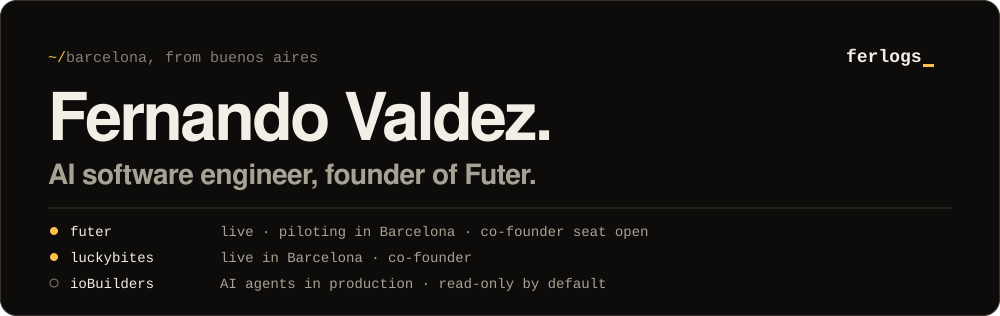

By day I put AI agents to work on a regulated platform at [ioBuilders](https://io.builders), and they cannot change anything without a person. By night I build [Futer](https://thefuter.com) and [Luckybites](https://luckybites.io). Both are live.

### Now

**Futer** organises amateur football. Find a match nearby, join in one tap, get teams balanced by rating. Piloting in Barcelona. I'm looking for a co-founder to own community and growth.

**Luckybites** is restaurant promos across Barcelona. Diners claim deals at partner venues and earn points for reviews. I'm the co-founder.

**ioBuilders** is Groovy, Java 21 and Micronaut on a digital trust platform for the legal sector, plus the agents that triage incidents and review merge requests.

### Worth your time

**[agent-ops](https://github.com/fervaldezjr/agent-ops)**: read-only Claude Code skills and a shared standards corpus for backend teams in production. The pattern my team runs, open sourced.

**[The agents on my team cannot change anything](https://www.ferlogs.com/writing/read-only-agents)**: the write-up behind it. 7 min read.

### Stack

**By day:** Groovy, Java 21, Micronaut, RabbitMQ, PostgreSQL, Kubernetes, ArgoCD
**By night:** TypeScript, Next.js, NestJS, Supabase

Hexagonal architecture, DDD and TDD. Boring tools where it counts, novelty spent on the product.

### Find me

[ferlogs.com](https://ferlogs.com) · [X @ferlogs_](https://x.com/ferlogs_) · [LinkedIn](https://www.linkedin.com/in/fervaldezjr/) · [CV](https://www.ferlogs.com/cv.pdf) · hi@ferlogs.com
